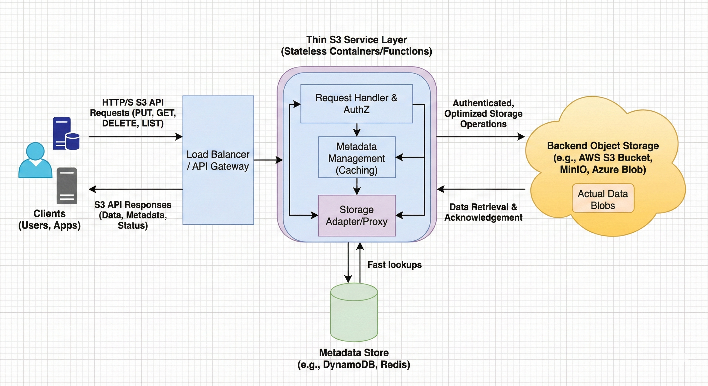

# Thin S3

A lightweight, efficient S3 file management API built with FastAPI, featuring multipart uploads, presigned URLs, automatic cache expiration, and Redis-backed lease management.

## Overview

Thin S3 is a production-ready file storage service that simplifies S3 interactions with intelligent caching and automatic cleanup. It provides a clean REST API for uploading, downloading, and managing files with configurable TTL-based expiration policies.

**Key Features:**
- ✅ Multipart upload support with presigned URLs
- ✅ Presigned download URLs for secure file access
- ✅ Redis-backed lease management with automatic expiration
- ✅ Configurable file TTL and cleanup intervals
- ✅ Full REST API with FastAPI
- ✅ LocalStack support for local S3 development
- ✅ Docker & Docker Compose ready
- ✅ Comprehensive test suite

## Architecture



The system is composed of the following components:

- **FastAPI Application**: REST API server handling file operations
- **S3 Service**: Boto3-based S3 client for bucket and multipart operations
- **Redis Cache**: Metadata storage with automatic TTL expiration
- **LocalStack/S3**: Object storage backend (supports both local and AWS)
- **Celery Workers**: Asynchronous task queue for background cleanup (optional)

## Project Structure

```
thin-s3/
├── app/
│   ├── api/
│   │   ├── endpoints/
│   │   │   ├── upload.py      # Upload initiation and presigned URLs
│   │   │   ├── storage.py     # Download, lease, and delete operations
│   │   └── router.py          # API router aggregation
│   ├── core/
│   │   ├── config.py          # Settings and environment config
│   │   └── security.py        # Security utilities
│   ├── models/
│   │   └── schemas.py         # Pydantic request/response schemas
│   ├── services/
│   │   ├── s3_service.py      # S3 operations wrapper
│   │   └── redis_cache.py     # Redis client and metadata handling
│   ├── worker/
│   │   └── tasks.py           # Celery background tasks
│   └── main.py                # FastAPI application entry point
├── requirements.txt           # Python dependencies
├── Dockerfile                 # Container image definition
├── docker-compose.yml         # Multi-container orchestration
├── .env.example               # Environment variable template
└── test_lifecycle.py          # End-to-end test suite
```

## Getting Started

### Prerequisites

- Python 3.11+
- Docker & Docker Compose (recommended)
- AWS credentials or LocalStack (for S3)
- Redis (standalone or via Docker)

### Installation

1. **Clone the repository:**
   ```bash
   git clone <repository-url>
   cd thin-s3
   ```

2. **Set up environment variables:**
   ```bash
   cp .env.example .env
   # Edit .env with your configuration
   ```

3. **Install dependencies (local development):**
   ```bash
   python -m venv .venv
   source .venv/bin/activate  # On Windows: .venv\Scripts\activate
   pip install -r requirements.txt
   ```

### Running with Docker Compose

The easiest way to get started:

```bash
docker-compose up --build
```

This starts:
- FastAPI application on `http://localhost:8000`
- LocalStack S3 on `http://localhost:4566`
- Redis on `localhost:6379`

### Running Locally

Start the services:

```bash
# Terminal 1: Start Redis
redis-server

# Terminal 2: Start LocalStack (optional, for local S3)
localstack start

# Terminal 3: Start the FastAPI app
uvicorn app.main:app --reload
```

Access the API documentation at `http://localhost:8000/docs`

## API Endpoints

### Upload Operations

**Initiate Multipart Upload**
```http
POST /upload/initiate
Content-Type: application/json

{
  "file_name": "document.pdf",
  "content_type": "application/pdf"
}

Response:
{
  "file_id": "uuid-string",
  "upload_id": "multipart-upload-id",
  "key": "uploads/uuid-string/document.pdf"
}
```

**Get Presigned Part URLs**
```http
POST /upload/presign-parts
Content-Type: application/json

{
  "file_id": "uuid-string",
  "upload_id": "multipart-upload-id",
  "part_numbers": [1, 2, 3]
}

Response:
{
  "part_urls": [
    {
      "part_number": 1,
      "url": "presigned-url-for-part-1"
    },
    ...
  ]
}
```

**Complete Multipart Upload**
```http
POST /upload/complete
Content-Type: application/json

{
  "file_id": "uuid-string",
  "upload_id": "multipart-upload-id",
  "parts": [
    {"part_number": 1, "etag": "etag-value"},
    ...
  ]
}

Response:
{
  "status": "completed",
  "location": "s3://bucket-name/uploads/uuid-string/document.pdf"
}
```

### Storage Operations

**Get Download URL**
```http
GET /storage/{file_id}/download

Response:
{
  "download_url": "presigned-download-url"
}
```

**Update File Lease**
```http
PATCH /storage/{file_id}/lease?ttl_seconds=7200

Response:
{
  "status": "success",
  "new_lease": "7200 seconds"
}
```

**Delete File**
```http
DELETE /storage/{file_id}

Response:
{
  "status": "deleted",
  "file_id": "uuid-string"
}
```

## Configuration

Edit `.env` to customize:

```env
# AWS Configuration
AWS_ACCESS_KEY_ID=your_access_key
AWS_SECRET_ACCESS_KEY=your_secret_key
AWS_REGION=us-east-1
S3_BUCKET=your-bucket-name
S3_ENDPOINT_URL=http://localstack:4566  # Use http://s3.amazonaws.com for AWS

# Redis Configuration
REDIS_URL=redis://localhost:6379

# FastAPI Configuration
APP_NAME=Thin S3
DEBUG=false

# TTL Configuration
DEFAULT_TTL_DAYS=30                # File expiration time
CLEANUP_INTERVAL_SECONDS=3600      # Cleanup job frequency
```

## Testing

Run the test suite:

```bash
pytest test_lifecycle.py -v
```

For async tests with detailed output:

```bash
pytest test_lifecycle.py -v -s --tb=short
```

## How It Works

### File Upload Flow
1. Client initiates multipart upload → receive `file_id` and `upload_id`
2. Client requests presigned URLs for each part
3. Client uploads parts directly to S3 using presigned URLs
4. Client completes multipart upload → file is finalized in S3
5. Metadata stored in Redis with automatic expiration

### File Expiration & Cleanup
- Each file gets a **TTL (Time To Live)** configured via `DEFAULT_TTL_DAYS`
- Redis automatically deletes expired metadata keys
- Optionally use Celery workers for background cleanup tasks
- Lease can be renewed using the `/storage/{file_id}/lease` endpoint

### Dual-Key Redis Strategy
- **Metadata Key** (`upload:{file_id}`): Stores file metadata, deleted on expiration
- **Lease Key** (`lease:{file_id}`): Tracks active file lease, can be extended

## Development

### Adding a New Endpoint

1. Create endpoint function in `app/api/endpoints/`
2. Add Pydantic schema to `app/models/schemas.py`
3. Register route in `app/api/router.py`
4. Add tests to `test_lifecycle.py`

### Extending S3 Service

Modify `app/services/s3_service.py` to add new S3 operations. The service wraps boto3 and provides:
- Bucket creation
- Multipart upload management
- Presigned URL generation

## Deployment

### AWS Production
1. Use AWS S3 instead of LocalStack
2. Set `S3_ENDPOINT_URL` to AWS S3 endpoint
3. Use RDS for Redis or AWS ElastiCache
4. Deploy with ECS, Lambda, or your preferred service

### Environment Variables
Ensure these are set in your deployment:
- `AWS_ACCESS_KEY_ID`
- `AWS_SECRET_ACCESS_KEY`
- `AWS_REGION`
- `S3_BUCKET`
- `REDIS_URL`

## Troubleshooting

**S3 Connection Error**
- Verify LocalStack is running: `docker ps | grep localstack`
- Check `S3_ENDPOINT_URL` configuration
- Ensure bucket exists in LocalStack

**Redis Connection Error**
- Verify Redis is running on configured URL
- Check `REDIS_URL` in `.env`
- For Docker Compose: ensure service names match

**Presigned URL Expires Too Quickly**
- Check expiration time settings in `app/services/s3_service.py`
- Default is 1 hour; adjust as needed

## Performance Considerations

- **Multipart uploads**: Recommended for files > 100MB
- **Presigned URLs**: Good for client-side uploads, reduces server load
- **Redis caching**: Keeps metadata in-memory for fast access
- **Cleanup intervals**: Balance between memory usage and cleanup frequency

## Contributing

1. Create a feature branch
2. Add tests for new functionality
3. Ensure all tests pass
4. Submit a pull request

## License

MIT License - See LICENSE file for details

## Support

For issues, questions, or suggestions:
- Open an issue on GitHub
- Check existing documentation in `/docs`
- Review test cases for usage examples

---

**Built with ❤️ using FastAPI, Redis, and boto3**
